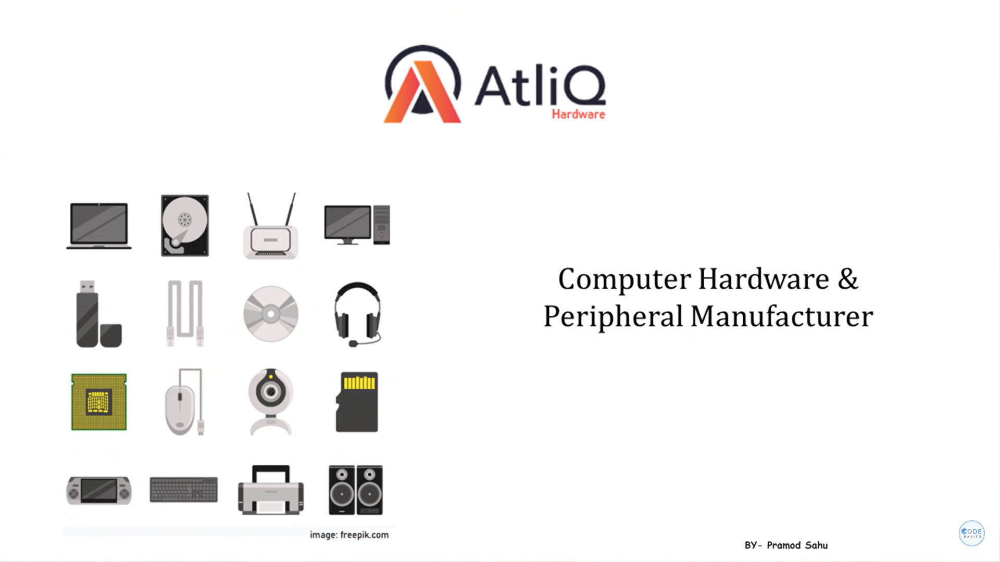

# My Data Analytics Portfolio

---

## [Learn About Me](/aboutme.md)

---

### Learn About My Projects

#### ["Iris Dataset "Analysis using Machine learning techniques](https://www.linkedin.com/pulse/iris-dataset-analysis-using-machine-learning-techniques-pramod-sahu-g3kgf/)

In this article, we embark on a journey into the Iris dataset, a classic in the field of machine learning. The dataset comprises 150 samples of iris flowers, each characterized by four features: sepal length, sepal width, petal length, and petal width. Our mission is to not only understand the data but also build and optimize a machine learning model for accurate classification.

---
#### ["Revolutionizing Decision-Making: Unleashing the Power of Real-Time Data with Tableau & MySQL](https://www.linkedin.com/pulse/revolutionizing-decision-making-unleashing-power-real-time-sahu-u5clf/)

Embark on a data-driven journey with Atliq Computer as we revolutionize sales insights using Tableau. Dive into our transformative approach, revealing real-time data benefits and strategic business improvements. Explore the future of sales innovation and join us at the forefront of the data-driven revolution

---
#### ["Building an Employee Management System with Python -SQL and Tkinter": A Step-by-Step Guide](https://www.linkedin.com/pulse/building-employee-management-system-python-sql-tkinter-pramod-sahu-dqogf/)

 
The project is an Employee Management System featuring a login page for user authentication. It allows users to add, search, update, and delete employee records, as well as display all employees and compute salaries, all with a graphical user interface.

---
#### ["Bike Sales Dataset and Dashboard Analysis: An Excel-Powered Exploration": A Step-by-Step Guide](https://www.linkedin.com/pulse/bike-sales-dataset-dashboard-analysis-excel-powered-exploration-sahu-4fnqf/)

 
Bike Sales Dataset and Dashboard Analysis" project leverages Excel's analytical capabilities to unveil critical insights into customer behavior, presenting findings through meticulously crafted visualizations. From uncovering correlations between income and bike purchases to exploring commute distance preferences and age-related patterns, the project culminates in an interactive "Bike Sales Dashboard," providing decision-makers with actionable insights for strategic business decisions in the dynamic bike sales landscape. Explore the comprehensive analysis and dashboard for a detailed exploration of the dataset.

---

---

### My Projects

- [Social_Network_Ads_implementation_of_KNN](https://github.com/Sahu337778/Social_Network_Ads_implementation_of_KNN)

---
###       [Resume coming soon](https://www.linkedin.com/in/pramod-sahu-1b34b8256/) 

###    [Tableau](https://public.tableau.com/app/profile/pramod.sahu/vizzes)

###                                      [LinkedIn](https://www.linkedin.com/in/pramod-sahu-1b34b8256/)

###              [GitHub](https://github.com/Sahu337778)
